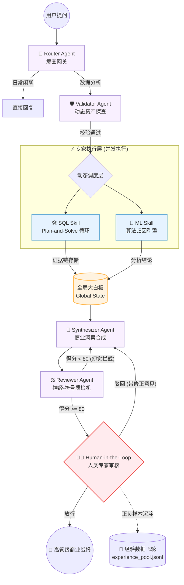

# 🚀 E-commerce Data Agent: AI 驱动的电商数据分析与归因工作流

> 本项目主打一个“用魔法打败魔法”：探索如何用 LLM 叠加机器学习与因果推断算法，把传统电商数据科学的工作流给“重做一遍”。

在这里，你可以看到代码从初出茅庐的“单体智能”，一路打怪升级到“多 Agent 协作”乃至“人机协同”的完整进化史。这不仅是一个自动化工具，更是对 **LLM + 结构化数据** 场景下“防幻觉”工程实践的深度探索。

-----

## 📂 版本导航与架构演进

### 📊 系统架构 v3 (System Architecture)



### 📍 [v3\_neuro\_symbolic\_hitl](https://www.google.com/search?q=./v3_neuro_symbolic_hitl) (当前里程碑版本)

**聚焦：工业级可靠性、防幻觉工程与人机协同**

这是目前最硬核的版本，解决了 Agent 落地“最后 1 公里”的信任问题：

  * **🛡️ 神经-符号质检 (Neuro-Symbolic)**：引入 `<raw>/<calc>` 双标签体系。通过 Python 正则表达式对 Agent 输出进行“脱水校验”，确保所有标记为原始数据的内容在 SQL 结果中 1:1 存在，从物理层面拦截计算幻觉。
  * **👨‍⚖️ 人类在环 (HITL)**：系统不再是“黑盒”。关键交付前挂起进程，由人类专家进行终极审美与逻辑审计。人类的驳回意见会直接反馈给 Agent 触发“回炉重造”机制。
  * **💾 经验数据飞轮 (Data Flywheel)**：自动将人机交互过程中的正负样本（Query -\> SQL -\> 反思意见 -\> 报告）沉淀为 JSONL 格式，为后续的 **SFT（监督微调）** 或 **RLHF（强化学习）** 提供高纯度“燃料”。
  * **⚡ 健壮性工程**：内置基于**指数退避 (Exponential Backoff)** 的 API 熔断保护与客户端限流，完美应对大模型 API 的 429 过载挑战。

### 📍 [v2\_multi\_agent\_framework](https://www.google.com/search?q=./v2_multi_agent_framework)

**聚焦：智能体编排与并行调度**

  * 实现了基于 `ThreadPoolExecutor` 的技能并发调用，将意图识别、数据查询与机器学习归因解耦。
  * 引入了初步的 Global State（全局白板）机制，支撑多 Agent 间的信息流转。

### 📍 [v1\_single\_agent\_baseline](https://www.google.com/search?q=./v1_single_agent_baseline)

**聚焦：NL2SQL 跑通与原型验证**

  * 验证了 Text-to-Insight 的基本可行性，内置轻量级电商测试数据库生成脚本。

-----

## 🛠️ 技术栈

  * **LLM**: DeepSeek / Kimi (Moonshot)
  * **Orchestration**: 原生 Python 实现的异步状态机（极简版 LangGraph 理念）
  * **ML/Data**: XGBoost, Scikit-learn, SQLite3, Pandas
  * **Engineering**: Git versioning, JSONL Data Flywheel, Regex-based Validation

-----

## 💡 演进思考：为什么不只是 Prompt Engineering？

在 V3 的开发中，我发现单纯靠 Prompt 无法彻底约束 LLM 的“算力本能”（如擅自汇总 GMV 产生的计算幻觉）。因此，本项目转向了\*\*“工程重于提示”\*\*的思路：

1.  **用代码约束模型**：如果不通过正则校验，报告永远无法触达用户。
2.  **用架构引导模型**：通过 `Plan-and-Solve` 循环和 `Reviewer` 反馈机制，让模型在不断的失败中自动修正取数口径。

-----

## 🚀 快速开始

```bash
# 1. 克隆仓库
git clone https://github.com/NoseaInC/Ecommerce-Data-Agent.git
cd ecommerce-data-agent/v3_neuro_symbolic_hitl

# 2. 配置环境变量
# 在 .env 文件中配置 KIMI_API_KEY 或 DEEPSEEK_API_KEY

# 3. 初始化 Mock 数据库
python init_db.py

# 4. 运行主程序
python main.py
```

-----

*本项目持续迭代中，下一阶段目标 (V4)：引入 Top-Down Planner（由报告规划师驱动的定向取数架构）。*